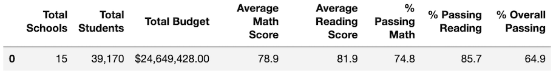
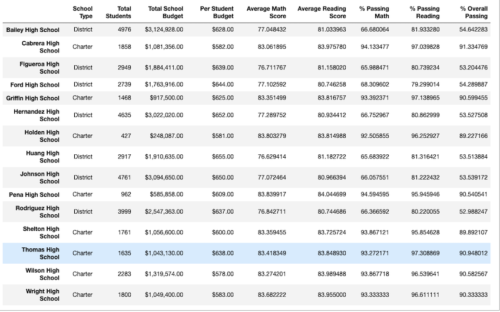
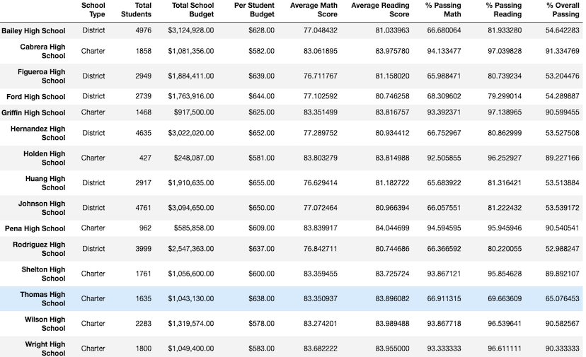
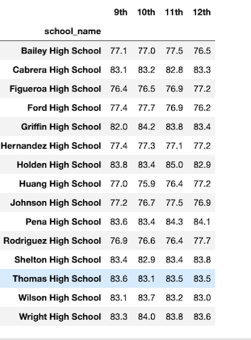
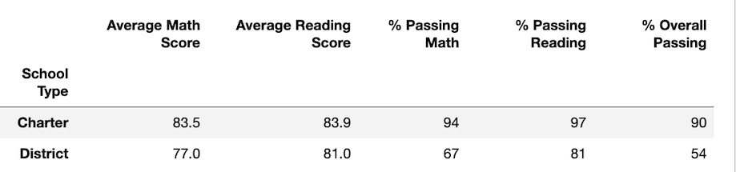

# School_District_Analysis
# Overview of the school district analysis

The main purpose of this analysis is to help Maria to replace the math and reading scores for Thomas High School 9th graders with NaNs while keeping the rest of the data intact. Then we repeat the school district analysis that we did in this module and compare the data to verify how these changes affect the overall analysis.

# Results

## How is the district summary affected?

Comparing the District Summary challenge results 

with District  Summary dataframe from the module, 

we can notice that in the changed dataframe  

- "Average Math Score" is reduced by 0.1
- No change in "Average Reading score" 
- "% Passing Math" is reduced by 0.2%
- "% Passing Reading" is reduced by 0.3%
- % Overall Passing" is reduced by 0.1%

## How is the school summary affected?

Comapring School Summary results 

As you can notice below,

 
Without changes to Thomas High School 9th grade scores,  the "% Passing Math", "% Passing Reading" and "% Overall Passing numbers are "93.272171", "97.308869" and "90.948012" respectively.

With making 9th grader scores to NaN, these percentages drop drastically to "66.911315", 	"69.663609" and "65.076453" as you can see below 

## How does replacing the ninth graders’ math and reading scores affect Thomas High School’s performance relative to the other schools?

With making 9th grader math and reading scores to NaN, the "% Passing Math", "% Passing Reading" and "% Overall Passing numbers dropped drastically by ~18-26%

## How does replacing the ninth-grade scores affect the following:

### Math and reading scores by grade
 
As you can see below, there is no change in the math and reading score results of 10th, 11th and 12th graders at Thomas High School.

#### Math Scores

#### Reading Scores

### Scores by school spending

AS you can see in screen shots below,

and

there has been no change in "Average Math Score", "Average Reading Score	", "% Passing Math", "% Passing Reading" and "% Overall Passing" for any of the spending bin ranges per student.

### Scores by school size

As you can see in screen shots below,

and 

"Average Math Score", "Average Reading Score", "% Passing Math", "% Passing Reading" and "% Overall Passing" for any of the school size ranges aren't affected by replacement of the ninth-grade scores.

### Scores by school type

As you can see in screen shots below,

and

"Average Math Score", "Average Reading Score", "% Passing Math", "% Passing Reading" and "% Overall Passing" for either Charter or District school aren't affected by the replacement of the ninth-grade scores.

# Summary

Four major changes that were observed with replacing 9th grade Math and Reading scores:

1. If we compare Passing Math & Passing Reading percentages in per school summary results, 

	- Thomas High School has seen 66.911315% passing math compared to 93.272171%. That is a huge drop of ~26.3%
	-  Thomas High School has seen 69.663609% passing math compared to 97.308869%. That is a huge drop of ~27.6%

2. Overall passing percentage for Thomas High School is only 65.076453 when compared to 90.948012 with a difference of 25.8%

3. In per School Summary results, Thomas High school has also seen slightly lower Average Math & Reading scores(83.418349 & 83.848930 compared to 83.350937 & 83.896082)

4. Entire district has seen slightly lower scores for Average Math and Average Reading. Also, seen a slight reduction in Passing Math, Passing Reading and Overall Passing percentages
